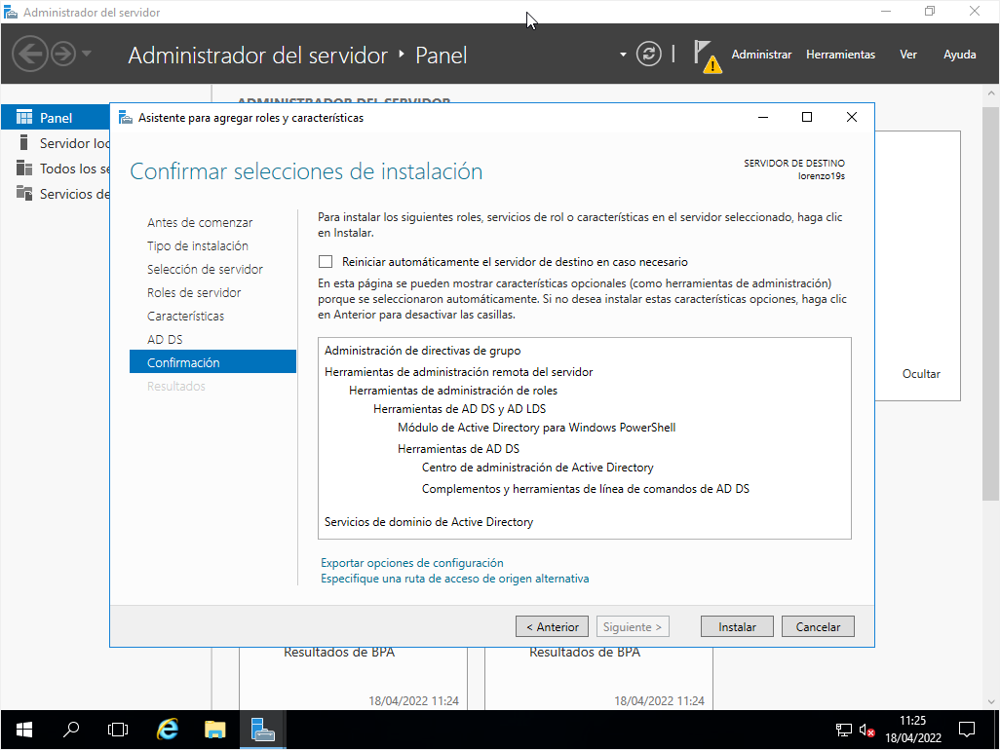
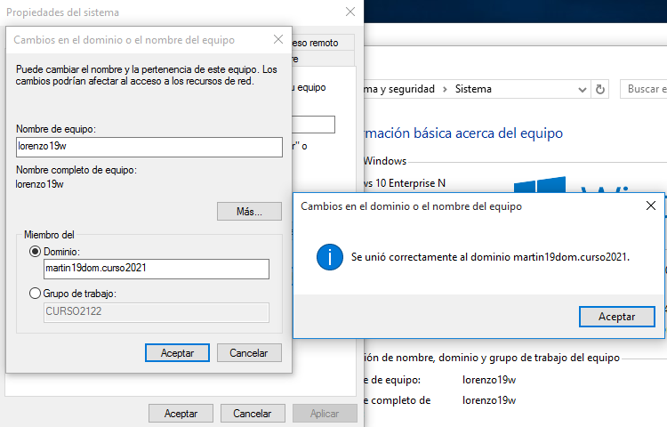
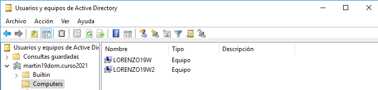
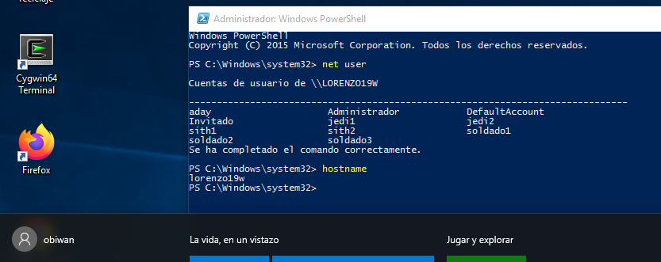
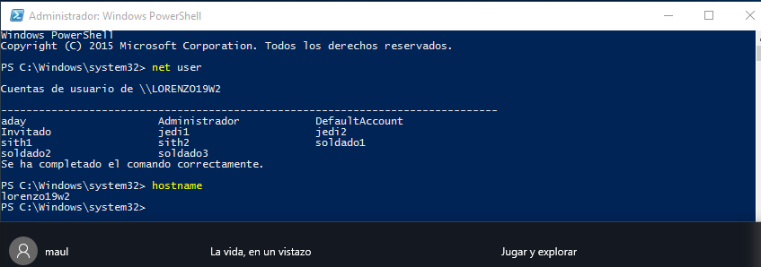
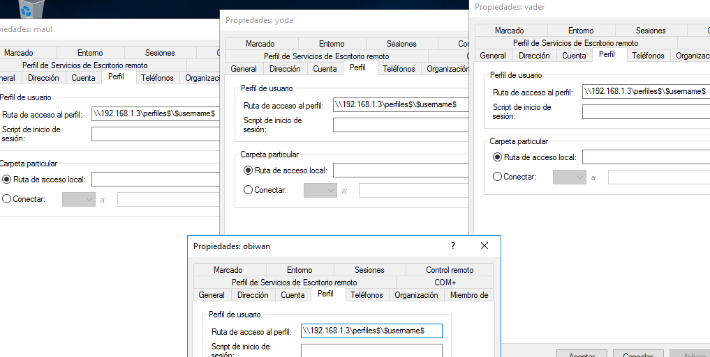
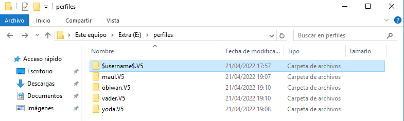

# PDC Winserver
~~~
Alumno: Aday Lorenzo Martín
~~~
## 1. Instalar el controlador de dominio:
- En primer lugar administramos el servidor para instalar el controlador de dominio

- Configuramos los servicios de Active Directory

- Comprobamos que nuestro equipo se ha añadido correctamente

## 2. Usuarios y equipos del dominio:
- Creamos los grupos y usuarios

- Comprobamos la conexión con el dominio desde cliente 1

- Ahora desde cliente 2

- Unimos al cliente 2 al dominio 

- Unimos al cliente 1 al dominio

- Comprobamos que se han añadido los cliente correctamente

- Comprobamos que entramos como obiwan y que no es un usuario local

- Comprobamos que entramos como maul y que no es un usuario local

## 3. Perfiles móviles
- Creamos un segundo disco de 1GB llamado extra

- Creamos la carpeta para los perfiles y asignamos permisos de control total a los usuarios del dominio

- Asignamos permisos al recurso compartido de red

- Configuramos las rutas de perfil de los usuarios. 

- Como se ve en la captura anterior, intenté usar la variable &#36;username&#36; pero como no se me veían las carpetas correspondientes en la carpeta perfiles, decidí escribir una ruta para cada usuario. El resultado fue el que se ve en la siguiente captura.

- Cuando me dispuse a revisar si el perfil era móvil, me encontré con que estaba configurado como un perfil local pero que además no podía cambiarlo. Es por esto que no pude avanzar de aquí.

